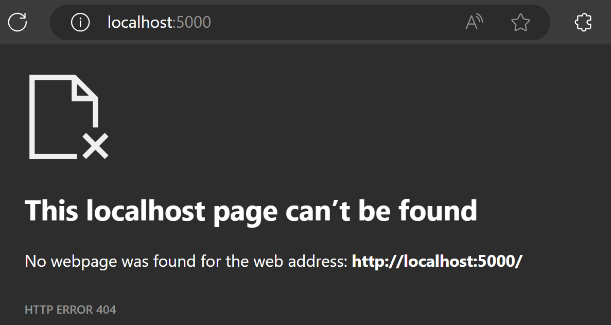

# Ejemplo de Flujo de Eventos

El ejemplo define 3 componentes:

- RabbitMQ: Un container que expone RabbitMQ a los demás componentes.
- WebAppProductor: Una aplicación web que permite enviar mensajes a través de RabbitMQ. Para ingresar el mensaje expone un endpoint REST.
- WebAppConsumidor: Una aplicación web que permite recibir mensajes a través de RabbitMQ. Los mensajes son visibles a través del log de la aplicación.

Los 3 componentes son instanciados utilizando Rancher Desktop.

## Technologías usadas

- [.NET 6.0](https://dotnet.microsoft.com/)
- [RabbitMQ](https://www.rabbitmq.com/)
- [Rancher Desktop](https://rancherdesktop.io/)

## ¿Cómo ejecutar?

### En Rancher Desktop

- Crear volumen `rabbitmqdata` a través del siguiente comando: `docker volume create --driver local rabbitmqdata`

### En Visual Studio

- Seleccionar docker-compose como proyecto de inicio.
- Ejecutar el proyecto Docker Compose.

### En línea de comandos

- En la carpeta raíz del repositorio, ejecutar el comando `docker-compose up -d` para crear las imágenes y posteriormente ejecutar los containers.
- En la carpeta raíz del repositorio, ejecutar el comando `docker-compose down` para borrar los containers. Este comando no borra las imágenes.

## ¿Cómo enviar un mensaje?

### Ejecutando en Visual Studio

Al ejecutar la solución en Visual Studio, se abrirá automáticamente la página de Swagger de WebAppProductor.

### Ejecutando en línea de comandos

Si se ejecuta la solución por línea de comandos:

- En Rancher Desktop, ir al panel Containers:

- Seleccionar el container `WebAppProductor`.
- A la derecha del nombre del container, hacer clic en el enlace para el puerto `5000`.

- La ventana abierta en el navegador no presentará ninguna página.

- En el navegador, abrir http://localhost:5000/swagger/index.html
- El puerto `5000` es asignado en el archivo `docker-compose.override.yml`.

- En la página de Swagger, hacer clic en el panel `/Productor`.
- Hacer clic en el botón `Try it out`.

- En el campo `mensaje` ingresar el contenido de un mensaje a transmitir.
- Hacer clic en el botón `Execute`.

## ¿Cómo verificar que el mensaje es recibido?

- En Visual Studio, en la ventana Containers:

- En Rancher Desktop, ir plugin Logs Explorer (debe ser instalado por separado).
- El mensaje aparece en una entrada del log del container:

