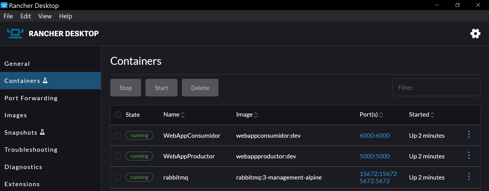
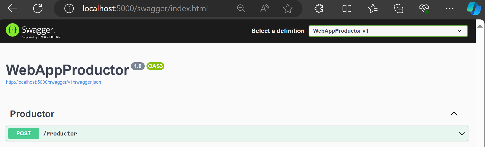

# Ejemplo de Flujo de Eventos

El ejemplo define 3 componentes:

- RabbitMQ: Un container que expone RabbitMQ a los demás componentes.
- WebAppProductor: Una aplicación web que permite enviar mensajes a través de RabbitMQ. Para ingresar el mensaje expone un endpoint REST.
- WebAppConsumidor: Una aplicación web que permite recibir mensajes a través de RabbitMQ. Los mensajes son visibles a través del log de la aplicación.

Los 3 componentes son instanciados utilizando Docker Compose.

## Technologías usadas

- [.NET 6.0](https://dotnet.microsoft.com/)
- [RabbitMQ](https://www.rabbitmq.com/)
- [Docker](https://www.docker.com/)

## ¿Cómo ejecutar?

### En Docker Desktop

- Crear volumen `rabbitmqdata`

### En Visual Studio

- Seleccionar docker-compose como proyecto de inicio.
- Ejecutar el proyecto Docker Compose.

### En línea de comandos

- En la carpeta raíz del repositorio, ejecutar el comando `docker-compose up -d` para crear las imágenes y posteriormente ejecutar los containers.
- En la carpeta raíz del repositorio, ejecutar el comando `docker-compose down` para borrar los containers. Este comando no borra las imágenes.

## ¿Cómo enviar un mensaje?

### Ejecutando en Visual Studio

Al ejecutar la solución en Visual Studio, se abrirá automáticamente la página de Swagger de WebAppProductor.

### Ejecutando en línea de comandos

Si se ejecuta la solución por línea de comandos:

- En Docker Desktop, ir al panel Containers:

- Seleccionar el container `WebAppProductor-1`.
- Debajo del nombre del container, hacer clic en el enlace para el puerto `443`.

- La ventana abierta en el navegador no presentará ninguna página, dado que la URL comienza con `http` en lugar de `https`.

- En la ventana del navegador, reemplazar `localhost:58476` por `https://localhost:58476/swagger/index.html`. El puerto `58476` es asignado automáticamente por Docker al momento de crear el container. En siguientes ejecuciones el número de puerto será diferente.

